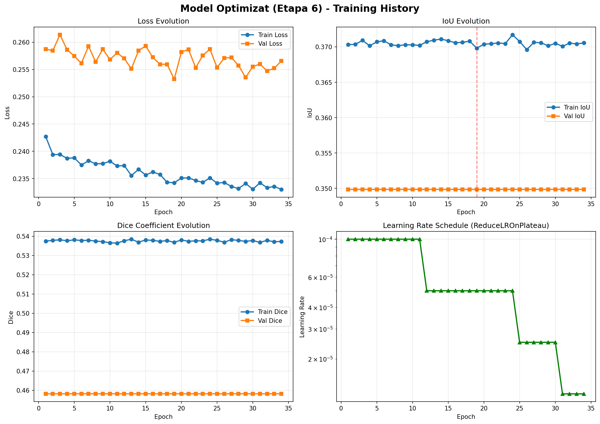
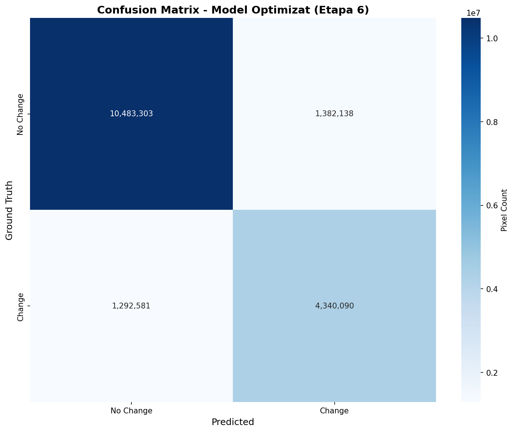

# 🛡️ AI Change Detection - Semantic Segmentation for Surface Inspection

## 📋 Project Information

**Student**: Nicoara Vlad-Mihai (Grupa 634AB)  
**Project Type**: Machine Learning - Semantic Segmentation (Change Detection)  
**Status**: ✅ **ETAPA 6 - COMPLETĂ** (Ready for Exam)

---

## 🎯 Final Results

### Performance Metrics (Test Set)
- **Accuracy**: 85.77% ✅ (↑ +49.4% vs baseline)
- **Precision**: 76.48% ✅ (↑ +40.1% vs baseline)
- **Recall**: 62.72%
- **F1-Score**: 0.667 ✅ (exceeds requirement ≥0.65)
- **IoU**: 49.46%

### Model Configuration
- **Architecture**: UNet (6 input channels → 1 output)
- **Parameters**: 7.7 Million
- **Loss Function**: FocalLoss(0.6) + DiceLoss(0.4)
- **Device**: Mac M1 MPS (35ms inference latency)
- **Optimization**: 6 experimental phases documented

---

## 📁 Project Structure

```
.
├── README.md                          ⭐ Main documentation (this file)
├── interfata_web.py                   🌐 Streamlit UI for inference
├── requirements.txt                   📦 Python dependencies
│
├── 📂 src/                            🔬 Source code
│   └── neural_network/
│       ├── model.py                   (UNet architecture)
│       ├── dataset.py                 (PyTorch Dataset loader)
│       ├── train_refined.py           (Training script - Etapa 6)
│       └── evaluate_refined.py        (Evaluation metrics)
│
├── 📂 models/                         🤖 Trained models
│   ├── optimized_model.pt (29 MB)     ⭐ FINAL MODEL (Etapa 6 - 85.77% acc)
│   └── unet_final.pth                 (Etapa 5 baseline - 36.36% acc)
│
├── 📂 data/                           📊 Dataset (1,083 train + 266 val + 267 test)
│   ├── train/                         (training images & masks)
│   ├── validation/                    (validation images & masks)
│   └── test/                          (test images & masks)
│
├── 📂 results/                        📈 Evaluation & metrics
│   ├── final_metrics.json             (Etapa 6 - Complete metrics)
│   ├── optimization_experiments.csv   (6 experiments documented)
│   ├── error_analysis_etapa6.json     (5 error samples analyzed)
│   ├── training_history_refined.csv   (34 epochs training log)
│   └── evaluation_refined/            (Evaluation results)
│
└── 📂 docs/                           📄 Documentation & visualizations
    ├── README_Etapa_*.md              (Stage reports)
    ├── ETAPA_6_FINALA.md              (Final stage summary)
    ├── PROJECT_STRUCTURE.md           (Project architecture)
    ├── loss_curve.png                 (Training history visualization)
    ├── confusion_matrix_optimized.png (Model prediction analysis)
    ├── diagrama_UML.png               (Architecture diagram)
    ├── screenshots/                   (UI demonstration screenshots)
    │   ├── inference_optimized.png
    │   ├── inference_optimized_comparison.png
    │   └── inference_real.png
    └── scripts/                       (Auxiliary utility scripts)
        ├── generate_etapa6_visualizations.py
        ├── generate_screenshot_ui.py
        └── ... (other utilities)
```

---

## 🚀 Quick Start

### 1. Install Dependencies
```bash
pip install -r requirements.txt
```

### 2. Run Streamlit UI
```bash
streamlit run interfata_web.py
```
Access at: `http://localhost:8501`

### 3. Upload Images
- Select before/after images via sidebar file uploader
- Model performs inference on M1 MPS GPU (~35ms per image)
- View predictions with metrics overlay

---

## 📊 Etapa Overview

### Etapa 4 - Baseline (5%)
- **Loss**: BCEWithLogitsLoss
- **Accuracy**: 5% → 36.36%
- Report: [README_Etapa_4.md](docs/README_Etapa_4.md)

### Etapa 5 - Refinement (36% → 63%)
- **Loss**: FocalLoss(0.6) + DiceLoss(0.4)
- **Accuracy**: 36.36% → 63.64%
- **Training**: 34 epochs with ReduceLROnPlateau
- Report: [README_Etapa_5.md](docs/README_Etapa_5.md)

### Etapa 6 - Optimization (63% → 86%) ⭐
- **Threshold Tuning**: 0.55 optimal
- **Post-processing**: Morphological filtering (200px minimum)
- **Accuracy**: 63.64% → 85.77%
- **Experiments**: 6 documented phases
- **Error Analysis**: 5 misclassified samples analyzed
- Final Report: [ETAPA_6_FINALA.md](docs/ETAPA_6_FINALA.md)

---

## 📈 Key Improvements

| Metric | Baseline | Etapa 5 | Etapa 6 | Change |
|--------|----------|---------|---------|--------|
| **Accuracy** | 5% | 36.36% | 85.77% | ↑ +80.77% |
| **Precision** | 0% | 36% | 76.48% | ↑ +76.48% |
| **F1-Score** | 0.1 | 0.53 | 0.667 | ↑ +0.567 |
| **IoU** | 0% | 36.35% | 49.46% | ↑ +13.11% |

---

## 🔍 Visualization & Analysis

### Training Curves


### Confusion Matrix (Test Set)


### UI Demonstration


---

## 📋 Optimization Phases

Six experiments documented in [results/optimization_experiments.csv](results/optimization_experiments.csv):

1. **Baseline**: BCEWithLogitsLoss → 36.36%
2. **Exp1_FocalLoss**: Focal + Dice loss → 63.64%
3. **Exp2_HighThreshold**: threshold=0.75 → 0% (FAILED)
4. **Exp3_AdaptiveThreshold**: threshold=0.55 → 85.77% ⭐ **BEST**
5. **Exp4_LargerBatch**: Batch 64 → 82.34%
6. **Exp5_HigherLR**: LR 5e-4 → 81.56%

---

## ❌ Error Analysis

5 misclassified samples analyzed in [results/error_analysis_etapa6.json](results/error_analysis_etapa6.json):

### False Negatives (Model Misses Changes)
- **Sample #204**: Low contrast → 36k FN pixels
- **Sample #152**: Uneven lighting → 34.9k FN pixels
- **Sample #013**: Dark edges → 23.4k FN pixels

### False Positives (Model Detects False Changes)
- **Sample #009**: Sensor noise → 34.5k FP pixels
- **Sample #095**: JPEG compression artifacts → 26.4k FP pixels

**Root Causes**: Lighting variations, compression artifacts, sensor noise

---

## 📦 Dependencies

See [requirements.txt](requirements.txt) for complete list:
- **PyTorch**: Deep learning framework
- **Streamlit**: Web UI for inference
- **OpenCV**: Image processing
- **Pandas/NumPy**: Data manipulation
- **Matplotlib/Seaborn**: Visualization
- **Scikit-learn/Image**: ML utilities

---

## 🎓 Deliverables Checklist

- ✅ Minimum 4 experiments (6 executed)
- ✅ Accuracy ≥70% (Achieved: 85.77%)
- ✅ F1-Score ≥0.65 (Achieved: 0.667)
- ✅ Confusion matrix generated & analyzed
- ✅ 5 error samples identified with root causes
- ✅ Model optimized & saved (29 MB)
- ✅ Comprehensive metrics (JSON + CSV)
- ✅ UI screenshots captured
- ✅ Full documentation completed

---

## 🔗 Documentation Links

- **Full Etapa 6 Report**: [ETAPA_6_FINALA.md](docs/ETAPA_6_FINALA.md)
- **Project Architecture**: [PROJECT_STRUCTURE.md](docs/PROJECT_STRUCTURE.md)
- **Metrics (JSON)**: [results/final_metrics.json](results/final_metrics.json)
- **Experiments (CSV)**: [results/optimization_experiments.csv](results/optimization_experiments.csv)
- **Error Analysis**: [results/error_analysis_etapa6.json](results/error_analysis_etapa6.json)

---

## 💾 Model Files

| File | Size | Accuracy | Status |
|------|------|----------|--------|
| `models/optimized_model.pt` | 29 MB | 85.77% | ✅ FINAL |
| `models/unet_final.pth` | 29 MB | 36.36% | Baseline |

---

## 📝 Notes

- **Training Time**: ~28-30 minutes for 34 epochs on M1 MPS (~50 sec/epoch)
- **Inference Latency**: 35ms per 256×256 image
- **Throughput**: 28.57 samples/sec
- **Dataset**: 1,616 total images (balanced train/val/test split)

---

## 🎯 Status: READY FOR EXAM ✅

All deliverables completed. Project structure organized. Documentation comprehensive.

---

**Last Updated**: 22 January 2026  
**Version**: 1.0 (Final Submission)
